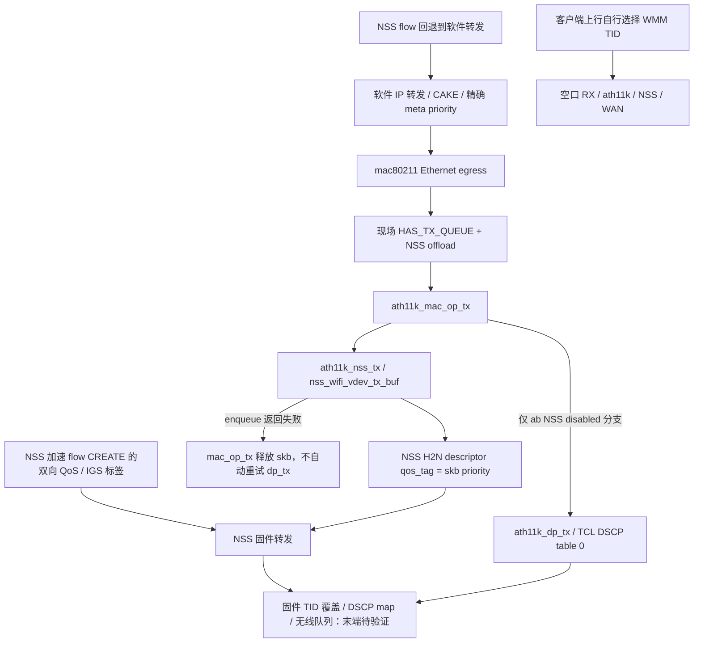

# Wi-Fi 只读观察、发送路径与三个离线修复候选

本轮完成独立手动观察入口、现场自然短窗、精确源码重建和三个定向修复。
没有安装候选、替换模块、重启服务、重载无线或修改无线参数。PR #1 保持草稿。
正式同机游戏/下载及最终空口 TID/AC 验收仍延期；读数和源码结论不替代这些验收。

## 仓库版本和安装版本

进入本轮时，开发分支 `codex/dorm-qos-v2` 的最新远端为 `112dfc2`。
维护入口是 `code/controller`；main 的旧 Windows 三槽实验不用于判断现网。
现场 19 个维护执行文件哈希全部匹配安装源码
`2996d405c9a96ec4d891887358f02f28de4e340c`，包含已部署的 writer 恢复表修复。
本轮新增的无线入口与三个驱动补丁尚未安装，现有安装命令不支持 `wifi-diagnose`。
此前单次部署授权不延续到本轮。

板端为 JDCloud RE-CS-02、kernel 6.18.44、ImmortalWRT `r0-90448ee`。
对应固件源码固定到
[90448eeb2b8f5d172caedfe6d96ab3bacb058c09](https://github.com/VIKINGYFY/immortalwrt/tree/90448eeb2b8f5d172caedfe6d96ab3bacb058c09)。
已按 [mac80211 配方](https://github.com/VIKINGYFY/immortalwrt/blob/90448eeb2b8f5d172caedfe6d96ab3bacb058c09/package/kernel/mac80211/Makefile)
验证 Backports 7.2 原始归档 SHA256、301 个配方/补丁 Git blob，按 Build/Patch 顺序应用全部 299 个补丁。
组顺序为 build、subsys、ath、ath5k、ath9k、ath10k、ath11k、ath12k、rt2x00、mt7601u、mwl、brcm、rtl，随后 nss/subsys、nss/ath10k、nss/ath11k。
原构建配置选中了 ath11k NSS 支持；三块现场 PHY 的 hwflags 也实际导出了 NSS/TID/队列标志，结论不只来自补丁文件存在。

[qca-nss-drv 配方](https://github.com/VIKINGYFY/immortalwrt/blob/90448eeb2b8f5d172caedfe6d96ab3bacb058c09/package/qca-nss/qca-nss-drv/Makefile)
固定 QSDK 13.1 源码到
[6aa14c78e097b29c493ff2fef87e4d35906b2b5a](https://git.codelinaro.org/clo/qsdk/oss/lklm/nss-drv/-/commit/6aa14c78e097b29c493ff2fef87e4d35906b2b5a)。
已从官方 Git 取回该对象，验证本地固件配方和全部 20 个补丁的 Git blob，并逐个成功应用。
完整补丁顺序和重建后文件哈希见 [源码证据](../evidence/dorm-v2-wifi-source.json)。

现场 ath11k 文件 SHA256 为 `8a0928ae768eefa98eb86ed58fe3a16554e96e90dbc7ec3b05e25d4441bef950`，
与此前保存的 CN 带宽修正模块一致；该本地修正只处理 CN 5735–5835 MHz 规则的带宽字段，不改 TX 分类。
mac80211/NSS 等现场模块哈希列在 [核查证据](../evidence/dorm-v2-wifi-audit.json)。
本轮没有复现整套安装二进制构建；源码谱系、磁盘文件哈希、实际 hwflags 和统计字段是分开的证据层。
现场 NSS 模块没有导出 `/sys/module/qca_nss_drv/version`；缺失已记录，不能伪造完整版本证明。

## 当前可用的手动命令

当前立即可用的是本地 SSH stdin 入口，它使用已有安全连接模块，路由器只临时执行观察代码，不安装文件：

```sh
node code/controller/wifi-observe.mjs \
  --transport /private/router-transport.mjs \
  --transport-cwd /private/connection-workspace \
  --private-dir /private/new-wifi-capture-directory \
  --seconds 30
```

连接模块导出 `connect()`，返回 `runStdin(command, source)`、`close()`；查询返回 `{code, stdout, stderr}`。
认证和主机密钥核验由已有私有连接模块负责，仓库不包含密码或该连接模块。
旧式仅有 `run(command)` 的适配器，只有源码请求小于 8000 字节时才允许回退；本轮源码需要 stdin。
首次长 exec 传输被 SSH 拒绝，stdin 传输随后通过现场验证，未据此更改 SSH 服务。

结果目录必须是新的目录。Linux 权限为目录 700、文件 600；Windows 在采集前取消继承并只授权当前用户、SYSTEM 和管理员。
`raw-private.json`、`transport-private.json` 含原始接口、MAC 和日志，只留私有目录。
`summary.json` 仅含本次 AP/radio/station 别名、类型化数值、状态和查询成本，可以审查后提交。
别名只在一次观察内稳定，不能当作跨窗口终端身份。

将来另获明确部署授权、安装这一候选后，板端入口才是：

```sh
/usr/lib/athena-dorm-native/athena-qos wifi-diagnose 30
```

该候选命令把原始记录写到新建的 `/tmp/athena-wifi-private.*` 私有目录，输出匿名报告和目录位置。
它独立于 reader、writer、六秒分类/准入租约及服务生命周期，没有新增常驻采集。

## 观察口径和成本

- 从 `iw dev` 和 `iw reg get` 动态发现接口、PHY、信道、中心频率、带宽、地区和发射功率；不推断 UCI radio 名称与 PHY 编号的对应关系。
- 只取两个端点，中间睡眠 5–120 秒，默认 30 秒。每次查询 1 秒超时、最多再等 1 秒终止；每端采集预算 20 秒，整个入口另有总限时。
- 每端最多执行 256 次查询、16 接口、8 PHY、64 station；单次输出最多 256 KiB、每端总输出 2 MiB。超过预算显式记录，不补零。
- 只读 survey、station dump、现有 NSS peer/host airtime/AQM/AQL 和已导出的 retry 文件；不 scan、不改变模式、不启用扩展/逐 TID 高开销统计。
- 保留 `missing`、`unsupported`、`failed`、`timeout`、`oversize`、预算耗尽、计数下降 reset、关联变化及 epoch 未确认。关联连接时间须与实际间隔吻合，重关联不得继续减旧计数。
- survey 只对同一 PHY 查询代表接口、同一频率和配置的两个端点作差；busy/active 仅在同源、有效非零暴露下相除。它包含本 BSS 活动，不是外部干扰率，也未证明覆盖完整 80 MHz。
- nl80211、NSS、host airtime 和 host AQM 的累计口径分别保留，不计算混合重试率、丢包率或吞吐率。AQM backlog/deficit/limit 是端点状态；已知同源累计字段才作差。
- AP TX 是无线下行，AP RX 是客户端上行。最近 TX/RX bitrate 是驱动估计，不等于实际吞吐；`tx failed` 可混入 NSS TQM 丢弃，不能直接称最终空口发送失败。

2026-10-11 00:26:43（UTC+8）完成的最终默认 30 秒观察实际覆盖 31.30 秒：120 次查询，84 成功、36 文件缺失，单次最长 0.14 秒，查询墙钟时间合计 1.28 秒。
没有超时/查询失败/截断；缺失文件仍是缺失。查询墙钟合计不是 CPU 消耗或业务性能验收。
最终默认观察前后保护比较确认 31 文件哈希、49 服务实例的 PID/运行态、五 WAN 的设备/地址、路由器 boot 和十个软件 CAKE 根保持；CAKE 比较仅排除 autorate 动态 bandwidth。
00:27:39 末次为 native-running、sourceFresh、未确认/待确认回执 0；窗口内来源暂停/恢复 0/0。
既有恢复表记录两个新的撤销恢复，末次 tracked/exhausted/quarantined 均为 0；没有故障注入。
该自然事件不能归因于无线读取，也不能据此宣称长期稳定或最终空口质量。
只查询十个原软件 CAKE 设备，没有读取 NSS 硬件 tc 队列。

## 射频观察与是否调整

以下匿名映射来自本次实际接口发现，别名不是固定硬件编号。

| AP | 实际主信道/中心频率 | 带宽/功率/地区 | 末次 station/信号 | 同源 busy/active | survey RX/TX 增量 |
|---|---|---|---|---|---|
| ap1 | 149 / 5775 MHz | 80 MHz / 20 dBm / CN | 3，-61 到 -54 dBm | 2615/30988 ms = 8.44% | 753 / 1058 ms |
| ap2 | 6 / 2437 MHz | 20 MHz / 20 dBm / CN | 0 | 8940/29989 ms = 29.81% | 0 / 119 ms |
| ap3 | 36 / 5210 MHz | 80 MHz / 20 dBm / CN | 3，-56 到 -43 dBm | 1590/30999 ms = 5.13% | 41 / 196 ms |

此前另一 30 秒窗口的 149/36 busy 分别为 5.69%/14.22%，TX 增量为 183/913 ms，详见 [首窗](../evidence/dorm-v2-wifi-first-window.json)。
中间一个 30 秒窗口的 149/36 busy 为 12.83%/18.35%，TX 437/2438 ms，见 [中间窗](../evidence/dorm-v2-wifi-middle-window.json)。
前两个窗口偏向 36，末窗活动则偏向 149；说明短时业务变化明显，尚无持续负载偏斜或容量瓶颈的证明。
两块 5 GHz 当前在不同的 80 MHz 频块（中心 5210 和 5775），并非重叠频块内只换主信道。
同一块内 149 换到 153 等不能当作换了频谱。

当前 NSS 字节/包/重试读数还受下述结构布局和累加缺陷影响；末窗这些计数为零而 TX duration 有增量，不能视为没有业务或没有重试。
这些短窗不代表宿舍高峰，信号也未显示可以据此调整功率的因果依据。
本轮保留信道、频宽、地区、功率和 WMM，没有按连接人数分配负载。

## 精确发送路径

行号指重建并应用原补丁序列后的源码，哈希由源码证据固定。



| 核查点 | 精确源码位置及结论 | 现场层或缺口 |
|---|---|---|
| 驱动标志 | ath11k/mac.c:11185、11204、11321 设置 HAS_TX_QUEUE、TID_CLASS_OFFLOAD、NSS_OFFLOAD | 三个 PHY 实际 hwflags 均为真；TX_ENCAP 也为真。AQL 是 nl80211 扩展能力，最终 PHY info 未观察到其宣告；这与查询失败或有效路径限流是不同状态 |
| 软件无线发送 | mac80211/tx.c:4910 NSS 跳转 tx_offload；4772 在 HAS 下跳过 select_queue；ath11k/mac.c:6959 NSS enabled 进入 nss_tx | IP 层/ECM flow 软件回退仍可从无线驱动走 NSS；不能称恢复了 mac80211 AQL |
| NSS 主机入口 | ath11k/nss.c:2129；nss_wifi_vdev.c:200；nss_core.c:2611、2872、3390 | descriptor 保留完整 skb priority 为 qos_tag；H2N CPU/ring 选择也不是无线 AC |
| H2N 环选择 | NSS ipq60xx 配方启用多环；nss_core.c:3403 以完整 priority 非零选择优先环 | RT 与含高位硬件 tag 的 BULK 均可非零，不能把该环当空口 RT/BULK 分离证据 |
| 普通非 NSS dp_tx | ath11k/dp_tx.c:222 选择 DSCP 表 0；hal_tx.c:26、64 不强制 TID_OVERWRITE/PACKET_TID | 默认 DSCP>>3 表；这是该分支源码，不把它当已启用 NSS 固件的最终表 |
| NSS TID 覆盖 | nss_wifi_vdev.h 有 DSCP/TID map、DSCP override、HLOS TID override API | 当前 ath11k nss.c 没有调用这些配置；API 存在不证明现场启用或默认值 |
| TID 到 AC | mac80211/wme.c:23 与 NSS nss_wifili_if.h:137：0/3 BE、1/2 BK、4/5 VI、6/7 VO | 最终空口 TID 尚未导出；不能用 CREATE 标签正确代替它 |
| AQL | tx.c:1616 跳过 TXQ setup，1684 跳过 enqueue，sta_info.c:717 跳过 station TXQ；AQL 限制在 tx.c:4255 的 TXQ 调度/出队上 | 开关 1、limit 5000/12000 us、pending 0，host AQM 只有表头；不证明 NSS/driver 路径受 AQL 限制 |
| 发送失败 | ath11k/nss.c:3558 合并 host retry_failed 和 NSS tx_failed；NSS tx_failed 来源为 TQM drop bins | 与重试耗尽不是同一累计口径，禁止直接当空口丢包率 |

软件分类函数 `cfg80211_classify8021d()`（net/wireless/util.c:964）会处理 QoS map/VLAN/特殊 priority，并有 RFC8325 修正；普通数值 6 的 meta priority 并不是 256..263 的强制分类魔数。
这里的“回退”须区分：ECM flow 退出加速后回到软件 IP 转发，仍可能经过 NSS 无线入口；只有 `ab->nss.enabled` 为假才进入普通 `ath11k_dp_tx`。
NSS 无线 enqueue 返回失败则在 mac.c:6964 释放 skb，没有自动转交 dp_tx 重试；管理帧及支持的 QoS-null 另走 WMI，不混作一般 RT/BULK 数据路径。
在无其它覆盖、软件分类实际被调用时，EF46 变为 UP6/VO；TCL 默认表则给 EF46 TID5/VI。
这个差异证明不能假设所有路径映射相同，不证明当前 NSS 固件就使用任一张表。
维护 writer 当前对精确合格 RT/BULK 使用低位 6/0 和高位硬件队列 tag，tag_rules 只写 meta priority，没有新增 DSCP 改写。
尚缺同一客户端 RT/BULK 的 DSCP/UP、固件最终 TID/AC、NSS 覆盖默认值和终端上行分类的联证。

## 已实现的三个离线候选

补丁位于 `code/controller/native/patches/`，针对上述原始完整补丁序列之后的源码。

| 候选 | 复现与修复 | 收益、代价及状态 |
|---|---|---|
| 001 peer drop 累加 | nss.c 的 tx_dropped 在多 peer 循环外初始化，后续 peer 包含前序丢弃；在每 peer 求和前清零 | 修正统计归属，不能承诺吞吐/游戏收益；原函数两种宏均失败，修后各 41 断言通过 |
| 002 host queue 初始化 | HAS 跳过 select_queue 后仍以未初始化 queue 索引数组；默认初始化为安全 BE，保留正常软件分类 | 消除未定义索引；NSS netdev 队列按 CPU 分配，不能拿 CPU queue 直接作 AC。原完整函数触发 -Werror=maybe-uninitialized，修后 160 断言通过；BE 是主机中转默认，不是强制最终空口 BE |
| 003 NSS 统计 ABI 对齐 | provider 编译宏有 NSS_FIRMWARE_VERSION_12_5，ath11k consumer 没有；peer stride 为 212/196，retry offset 为 188/180 | 使用同一真实导出头及实际 Makefile flags，原三 peer 消息错位，修后三 peer 全匹配；仅 NSS 支持开启时对齐当前配方宏 |

现场 `nss_stats` 成功导出旧字段，但没有宏控制的 tx_mpdu_retries/tx_mpdu_total_retries 两个字段，与未启用 consumer 宏的源码一致。
第三项是 provider/consumer 源码及构建标志不一致的可复现证据；仍未抓取原始固件消息确认现场固件 ABI，不能把每个异常读数或游戏丢包归为该缺陷。
三个测试分别抽取完整真实函数或未改写的真实导出结构；锁、peer lookup、kernel I/O 和合成消息是测试替身。
没有构建完整 Wi-Fi/NSS 模块、运行新固件或在现网验证修复后的队列/统计。三个补丁未提交通用上游。
未来应用需匹配固件配方/头文件、完成目标模块/包构建、保留旧模块和回退，并另获明确维护窗口许可。

## 候选优化的决策依据

| 候选 | 何时值得做 | 预期收益和代价 |
|---|---|---|
| 先修统计布局与归属 | 本轮已具源码/离线复现，优先准备目标构建 | 使负载、重试和失败判断可用；代价是驱动/固件 ABI 核验及另获许可的模块维护窗口 |
| 精确 RT 映射一致性 | 取得同机 RT/BULK 最终 TID，证实存在分类退化后 | 仅对合格流修 DSCP/UP/覆盖路径；先评估 VI 是否足够，不默认全部 RT 进 VO。代价是与 BULK 争用及映射变更验收 |
| 两个 5 GHz 负载调整 | 更多自然高峰窗口显示持续活动偏斜，统计可信且相关重试/队列压力可复现 | 可通过受限的客户端归属/射频方案改善拥塞；人数相等也可能负载不同，不能先加设备权重或激进漫游 |
| 频宽/频谱选择 | 持续拥塞、重试和可用频谱证据支持，且另获无线变更许可 | 真正不同频块或较窄带宽可能减少竞争；代价是峰值吞吐、DFS/兼容及无线重载断连。当前不选择新信道/频宽 |
| 客户端上行 QoS | 确认该客户端应用分类/WMM TID 与无线争用症状 | 空口发出前由客户端决定；AP 下行标签不能追溯修正已发生的上行竞争，需客户端侧证据和配合 |
| AQL 参数 | 当前跳过 host TXQ 的源码下，没有靠改低/高阈值获得限制的依据 | 保留现值；先定位 driver/NSS 队列深度及控制点，不能为启用 AQL 擅自关闭 NSS 或替换模式 |

保留 WMM、现有 NSS、五 WAN、认证/PBR/NAT、原 CAKE/autorate、代理/Tailscale、帧聚合和省电配置。
没有新增所有 UDP 提权、人均限速、设备权重或激进漫游。
待补：完整二进制可复现构建、现场 firmware 统计 ABI、实际 NSS TID 覆盖/映射表、同终端双向混合流空口队列与正式端到端游戏 Loss/Miss/延迟验证。

## 离线复核命令与证据

```sh
python3 tools/run_controller_offline.py
python3 tools/test_wifi_transport.py
python3 tools/test_wifi_peer_drop.py --source /private/reconstructed/backports
python3 tools/test_wifi_tx_queue.py --source /private/reconstructed/backports
python3 tools/test_wifi_stat_abi.py --source /private/reconstructed/backports \
  --nss-source /private/reconstructed/nss-drv --firmware-source /private/firmware-source
python3 tools/test_source_manifest.py
python3 tools/check_repository.py
```

源码重建用 `tools/audit_wifi_source.py --source ... --tree ... --archive ... --nss-git ... --output NEW_DIR`；
输入分别为固定固件源码及原构建配置、完整固定 Git tree、哈希验证的 Backports 归档、含固定 NSS commit 的 Git 仓库。
该工具不会构建/连接/部署到路由器。
维护离线套件为 10 个 Lua 和两个 C 来源测试，33 个 Lua 语法检查通过，无线模型 158 断言；传输测试四项通过。
统计与队列修复的原版失败是期望的定向复现，不隐藏为成功。

证据：[完整观察](../evidence/dorm-v2-wifi-observation.json)、[入口验证](../evidence/dorm-v2-wifi-smoke.json)、
[peer drop](../evidence/dorm-v2-wifi-peer-drop.json)、[host queue](../evidence/dorm-v2-wifi-tx-queue.json)、
[结构 ABI](../evidence/dorm-v2-wifi-stat-abi.json)、[维护测试](../evidence/dorm-v2-wifi-offline.json)、[汇总核查](../evidence/dorm-v2-wifi-audit.json)。
原始日志、MAC、实际终端身份、模块和连接资料只留本地私有目录，仓库只收匿名模型/汇总及可审查源码。
